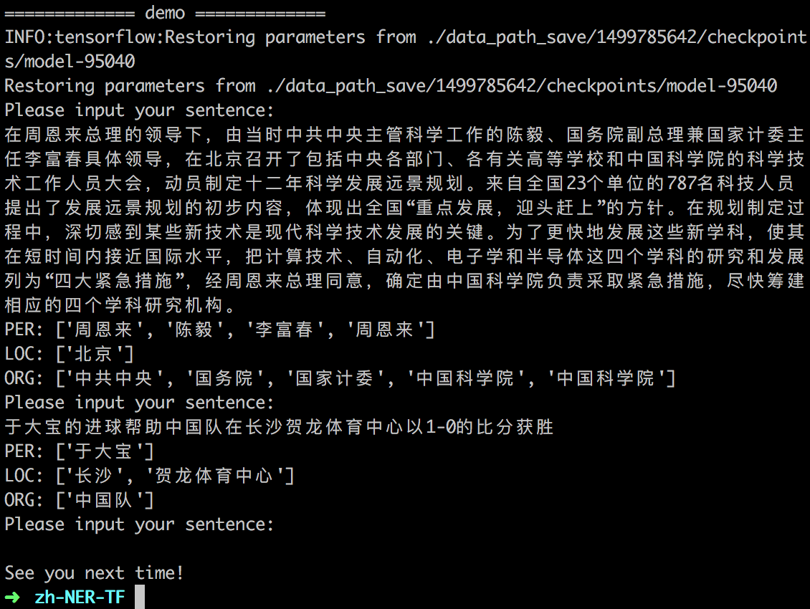

## ChineseNER
运行环境：python3  TensorFlow 1.2

### Train
#### 使用CreateData.py修改输入文件的格式，从分词变为单个单词，从BIO标签转为BI标签
  修改CreateData.py中的input和output（input为文件train.txt的路径）
  `python CreateData.py `
  将输出的output文件按90%:10%的比例分成训练集和验证集，改名为train_data和test_data放到data_path文件夹中
#### 调整超参数进行训练
  `python main.py --mode=train `
  可以对main.py中的超参数修改，如
  `python main.py --mode=train --epoch=30`
#### 使用模型进行预测
  main.py中，有两行
  `elif args.mode == 'demo\': `
  运行
  `python main.py --mode=demo --demo_model=1543146557`
  前者可以直接输入句子进行测试，后者可以预测文件并产生输出。在使用后者前记得修改里面的input和output路径。
最后将输出的output文件中所有0替换成O。

## A simple BiLSTM-CRF model for Chinese Named Entity Recognition

This repository includes the code for buliding a very simple __character-based BiLSTM-CRF sequence labelling model__ for Chinese Named Entity Recognition task. Its goal is to recognize three types of Named Entity: PERSON, LOCATION and ORGANIZATION.

This code works on __Python 3 & TensorFlow 1.2__ and the following repository [https://github.com/guillaumegenthial/sequence_tagging](https://github.com/guillaumegenthial/sequence_tagging) gives me much help.

### model

This model is similar to the models provied by paper [1] and [2]. Its structure looks just like the following illustration:

For one Chinese sentence, each character in this sentence has / will have a tag which belongs to the set {O, B-PER, I-PER, B-LOC, I-LOC, B-ORG, I-ORG}.

The first layer, __look-up layer__, aims at transforming character representation from one-hot vector into *character embedding*. In this code I initialize the embedding matrix randomly and I know it looks too simple. We could add some language knowledge later. For example, do tokenization and use pre-trained word-level embedding, then every character in one token could be initialized with this token's word embedding. In addition, we can get the character embedding by combining low-level features (please see paper[2]'s section 4.1 and paper[3]'s section 3.3 for more details).

The second layer, __BiLSTM layer__, can efficiently use *both past and future* input information and extract features automatically.

The third layer, __CRF layer__,  labels the tag for each character in one sentence. If we use Softmax layer for labelling we might get ungrammatic tag sequences beacuse Softmax could only label each position independently. We know that 'I-LOC' cannot follow 'B-PER' but Softmax don't know. Compared to Softmax layer, CRF layer could use *sentence-level tag information* and model the transition behavior of each two different tags.

### dataset
|    | #sentence | #PER | #LOC | #ORG |
| :----: | :---: | :---: | :---: | :---: |
| train  | 46364 | 17615 | 36517 | 20571 |
| test   | 4365  | 1973  | 2877  | 1331  |

It looks like a portion of [MSRA corpus](http://sighan.cs.uchicago.edu/bakeoff2006/).

### train

`python main.py --mode=train `

### test

`python main.py --mode=test --demo_model=1521112368`

Please set the parameter `--demo_model` to the model which you want to test. `1521112368` is the model trained by me. 

An official evaluation tool: [here (click 'Instructions')](http://sighan.cs.uchicago.edu/bakeoff2006/)

My test performance:

| P     | R     | F     | F (PER)| F (LOC)| F (ORG)|
| :---: | :---: | :---: | :---: | :---: | :---: |
| 0.8945 | 0.8752 | 0.8847 | 0.8688 | 0.9118 | 0.8515

### demo

`python main.py --mode=demo --demo_model=1521112368`

You can input one Chinese sentence and the model will return the recognition result:

### references

\[1\] [Bidirectional LSTM-CRF Models for Sequence Tagging](https://arxiv.org/pdf/1508.01991v1.pdf)

\[2\] [Neural Architectures for Named Entity Recognition](http://aclweb.org/anthology/N16-1030)

\[3\] [Character-Based LSTM-CRF with Radical-Level Features for Chinese Named Entity Recognition](http://www.nlpr.ia.ac.cn/cip/ZhangPublications/dong-nlpcc-2016.pdf)

\[4\] [https://github.com/guillaumegenthial/sequence_tagging](https://github.com/guillaumegenthial/sequence_tagging)  
